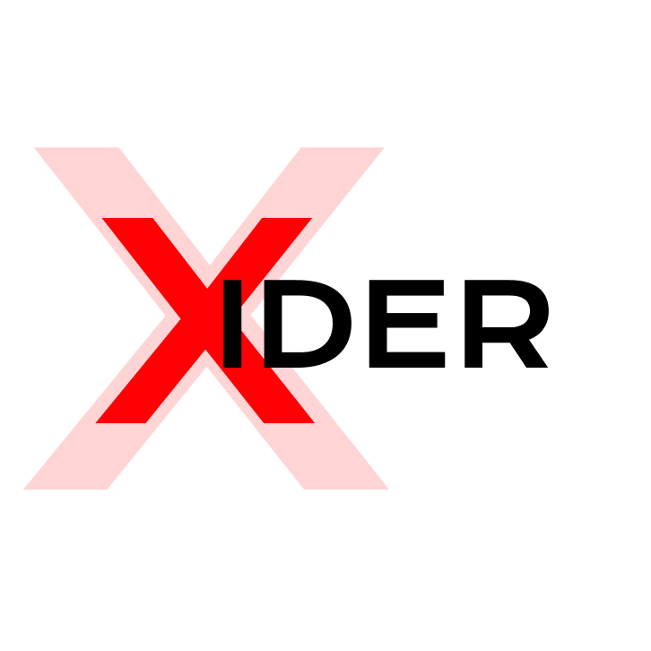

# ⚡ XIDER: Zero-Trust Endpoint Management & Telemetry System

<p align="center">
  
</p>

<p align="center">
  <a href="https://github.com"></a>
  <a href="https://github.com"></a>
  <a href="https://github.com"></a>
  <a href="https://github.com"></a>
  <a href="LICENSE"></a>
</p>

---

## 📖 Overview

**XIDER** is a high-performance, asynchronous remote endpoint administration and telemetry system. It enables secure, real-time device monitoring, diagnostics, and management through a Telegram Bot interface backed by a hardened, TLS-encrypted MQTT pub/sub message broker.

Designed with a **Zero-Trust** security architecture, XIDER treats the network transport as untrusted: all commands and telemetry are authenticated with **HMAC-SHA256**, protected against replay attacks via **nonce/timestamp deduplication**, and optionally encrypted end-to-end with **AES-256-GCM**.

---

## 🏛 System Architecture

```mermaid
graph TD
    User([Telegram User / Admin]) <-->|Telegram Bot API (HTTPS)| BotServer[TG-BOT-SERVER (aiogram 3)]
    
    subgraph Secure Messaging Mesh
        BotServer <-->|TLS 1.3 / mTLS| Broker[Mosquitto MQTT Broker]
    end

    subgraph Endpoints [Managed Devices]
        Broker <-->|HMAC-SHA256 + AES-256-GCM| WDS[XGENT-WDS<br/>Windows Endpoint Agent]
        Broker <-->|HMAC-SHA256 + AES-256-GCM| MCS[XGENT-MCS<br/>macOS Endpoint Agent]
    end

    classDef server fill:#2b3a42,stroke:#4f5d75,stroke-width:2px,color:#fff;
    classDef broker fill:#1f4068,stroke:#162447,stroke-width:2px,color:#fff;
    classDef agent fill:#0f4c75,stroke:#3282b8,stroke-width:2px,color:#fff;
    class BotServer server;
    class Broker broker;
    class WDS,MCS agent;
```

---

## 🛡️ Security Architecture

Detailed specification is available in [SECURITY.md](SECURITY.md).

* **Zero-Trust Payload Signing**: Every command is signed with HMAC-SHA256 (`SHARED_KEY`). Even if an adversary compromises the broker, commands cannot be forged or tampered with.
* **Anti-Replay Attack Protection**: All messages contain an ISO timestamp and unique cryptographic nonce. Nonces are tracked in a circular cache; messages older than 120s are rejected.
* **End-to-End Payload Encryption**: AES-256-GCM authenticated encryption derived via HKDF-SHA256 prevents traffic snooping on all telemetry and file transfers.
* **MQTT Last Will and Testament (LWT)**: Endpoints register a cryptographically signed LWT message upon connect. If a machine crashes or loses network connectivity, the broker immediately broadcasts its offline status to the bot.
* **Role-Based Access Control (RBAC)**: Strict role tiers (`ADMIN`, `TRUSTED`, `VIEWER`) regulate access to privileged commands (shell, power, input).
* **Comprehensive Audit Trail**: Security-critical actions are logged with timestamp and user identity in `audit.log`.

---

## ⚡ Feature Matrix

| Feature Category | Capability | Windows (`XGENT-WDS`) | macOS (`XGENT-MCS`) |
| :--- | :--- | :---: | :---: |
| **Surveillance & Media** | Screen capture (all monitors) | ✅ | ✅ |
| | Webcam snapshot / video record | ✅ | ✅ |
| | Microphone audio surveillance | ✅ | ✅ |
| | Text-to-Speech (TTS) broadcast | ✅ | ✅ |
| | Master Volume control & Toggle Mute | ✅ | ✅ |
| **Hardware & Display** | Hardware Display Brightness | ✅ (WMI/VCP) | ✅ (AppleScript/CLI) |
| | Multi-monitor rotation (0/90/180/270°) | ✅ | ⚠️ |
| | Sleep / Display sleep / Night light | ✅ | ✅ |
| **Input & Automation** | Clipboard read / write | ✅ | ✅ |
| | Keystrokes & Hotkeys simulation | ✅ | ✅ |
| | Crazy cursor / Mouse swap prank | ✅ | ⚠️ |
| **System & Files** | Full Telemetry (CPU, RAM, Disks, Battery) | ✅ | ✅ |
| | Process list, termination, app launcher | ✅ | ✅ |
| | File browser & Download / Upload | ✅ | ✅ |
| | Command line (PowerShell / Bash) | ✅ | ✅ |
| | Desktop Wallpaper change & restore | ✅ | ✅ |
| | Wake-on-LAN (Magic Packet) | ✅ | ✅ |
| | Background Windows Service / Autostart | ✅ (Registry/Task) | ✅ (LaunchAgent) |

---

## 🚀 Quickstart Guide

### 1. Requirements
* Python 3.11+
* Docker & Docker Compose (for the MQTT broker, or existing Mosquitto)

### 2. Start the Private MQTT Broker
```bash
cd broker
docker compose up -d
```

### 3. Launch Telegram Bot Server
```bash
cd TG-BOT-SERVER
cp .env.example .env
# Edit .env and supply your BOT_TOKEN and SHARED_KEY
pip install -r requirements.txt
python bot.py
```

### 4. Deploy Endpoint Agents

#### Windows:
```bash
cd XGENT-WDS
cp .env.example .env
# Edit .env with your broker credentials and SHARED_KEY
pip install -r requirements.txt
python xgent_wds.py
# Or compile standalone EXE:
build_exe.bat
```

#### macOS:
```bash
cd XGENT-MCS
cp .env.example .env
# Edit .env with your broker credentials and SHARED_KEY
pip install -r requirements.txt
./start_agent.sh
# Or compile standalone binary:
./build_standalone.sh
```

---

## 🔄 CI/CD & Automated Cloud Builds

This repository includes GitHub Actions workflows:
* **CI Suite (`ci.yml`)**: Automatically validates all 55+ unit and integration tests across Python 3.11 and 3.12 on every push.
* **Release Builder (`build-agents.yml`)**: On git release tags (`v*`), automatically builds `XGENT-WDS.exe` on Windows runners and `XGENT-MCS` standalone binary on macOS runners, publishing them directly as release assets.

---

## ⚖️ Legal Disclaimer

This software is developed strictly for educational purposes, defensive security research, and authorized personal endpoint management. The authors assume no liability for misuse or damage caused by this software.
