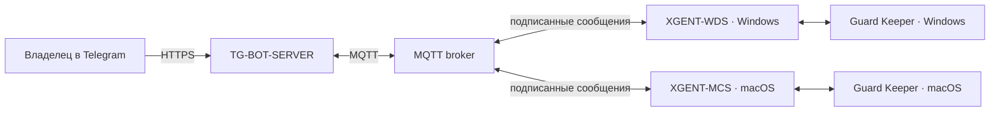

# XIDER · TARPED

[English](README.md) · Русский

XIDER — система для управления собственными устройствами Windows и macOS из Telegram. Телеграм-бот проверяет доступ, показывает статус и передаёт устройству конкретную команду. Работу выполняет установленный агент; если агент или компьютер недоступен, интерфейс должен показать тайм-аут, а не выдумывать успешный результат.

> Версия этой сборки: 4.2.0. Это не означает, что она уже опубликована или установлена на VPS и устройствах. Устанавливаемые версии появляются в [GitHub Releases](https://github.com/invinby/XIDER/releases) после сборки и проверки.

## Установка

Короткие установщики опубликованного релиза доступны через GitHub Pages:

macOS:

```sh
curl -fsSL https://invinby.github.io/XIDER/mac | bash
```

Windows PowerShell:

```powershell
irm https://invinby.github.io/XIDER/win.ps1 | iex
```

Эти команды запускают подписанные установщики релиза; установщик проверяет подпись и закреплённые данные bootstrap. Во время первой установки может потребоваться SSH-доступ к VPS для получения конфигурации агента. Разрешения macOS выдаются на самом Mac — команда из Telegram не может выдать системное разрешение вместо пользователя.

В Telegram для ручной установки есть раздел владельца **Устройства → Установка · одна команда**. Там можно выбрать macOS или Windows и скопировать соответствующую строку в терминал.

## Из чего состоит XIDER



- **TG-BOT-SERVER** — Telegram-интерфейс, роли, проверка разрешений, каталог релизов и управление устройствами.
- **XGENT-WDS** и **XGENT-MCS** — агенты Windows и macOS. Они сообщают статус, принимают разрешённые команды и возвращают результат.
- **Guard Keeper** — supervisor, который сообщает собственное состояние и умеет восстановить рабочий агент согласно локальной настройке. Он не гарантирует работу выключенного или разряженного компьютера.
- **X-LEDGER** — каталог опубликованных GitHub Releases. В нём доступны теги версий и описания релизов.
- **X-DOCK** — установка и обновление агентского пакета. До замены файлов проверяются доверенная подпись издателя, manifest и хеши; создаётся резервная копия, затем проверяется запуск и при неудаче возвращается прежняя версия.
- **X-LEX** — шесть голосов интерфейса: X-TECH, X-PERSON, X-PIKMI, X-TARPED, X-CORE и X-ADAM. Голос меняет формулировки, но никогда не права, подтверждения или действие команды.
- **X-TRACE** — журналирование действий и событий для последующей диагностики.

Названия компонентов описывают отдельные обязанности, а не обещают, что каждый пункт уже принят на физических устройствах. Например, **TwinShift** — имя целевой архитектуры обновления с двумя слотами; это не следует путать с текущей транзакционной заменой файлов.

## Обновление и выбор версии

В карточке устройства откройте **Версии**. X-LEDGER загружает опубликованные GitHub Releases; выбранный релиз можно открыть, прочитать заметки и запросить установку именно по его Git-тегу. Перед отправкой команды бот показывает подтверждение. Агент принимает обновление только когда совместим с протоколом и подтвердил наличие закреплённого доверенного ключа; manifest и пакет должны пройти проверку подписи и целостности.

Переключение голоса интерфейса не меняет проверку подписи. Версия без подходящего пакета, доверия издателю или совместимой версии агента не должна становиться доступной для установки. Успех отправки команды сам по себе ещё не означает, что физическое устройство завершило установку: дождитесь финального результата агента.

## Роли и границы возможностей

- **Гость** — только просмотр разрешённых экранов.
- **Пользователь** — выданные владельцем устройства и отдельные действия.
- **Владелец** — администрирование и полный доступ; основной владелец определяется защищённой конфигурацией.

Статус «онлайн» означает, что недавно пришёл heartbeat, а не бесконечную гарантию доступности. Геолокация по публичному IP приблизительна и не является GPS. Камера, микрофон, запись экрана и другие системные возможности требуют разрешения ОС и отдельной разрешённой команды. Если компьютер выключен или потерял сеть, бот не может получить от него новый результат.

## Открытие сайта из Telegram

В сетевом разделе выберите **Открыть сайт**, отправьте HTTP(S)-адрес, затем выберите 1, 2, 3 или 5 открытий. Агент откроет ссылку браузером, назначенным в системе. Браузер может создать вкладки вместо отдельных окон — это решает сам браузер. Ссылки `file:`, `javascript:` и другие локальные/внешние схемы не принимаются. Владелец также может сохранять ссылки в избранное.

## Запуск из исходников

Требуются Python 3.11+; для локального MQTT-брокера — Docker и Docker Compose. Секреты не хранятся в Git: создайте локальный `.env` на основе соответствующего `.env.example` и укажите параметры своего окружения.

Запустить брокер:

```sh
cd broker
docker compose up -d
```

Запустить Telegram-бот:

```sh
cd TG-BOT-SERVER
python -m pip install -r requirements.txt
python bot.py --serve
```

Запустить агента из его каталога можно только после настройки собственного `.env` и зависимостей:

```sh
cd XGENT-WDS
python -m pip install -r requirements.txt
python xgent_wds.py
```

```sh
cd XGENT-MCS
python3 -m pip install -r requirements.txt
./start_agent.sh
```

`--serve` предназначен для серверного процесса бота; обычный запуск может использовать локальный launcher. Перед развертыванием проверьте инструкции в [`deploy/README.md`](deploy/README.md), не переносите `.env` в Git и не запускайте неподписанные тестовые пакеты на рабочем устройстве.

## Проверки и статус готовности

Полный локальный набор тестов запускается из корня репозитория:

```powershell
python tools/run_tests.py
```

Он использует тестовые настройки и не подключается к Telegram, MQTT или VPS. GitHub Actions дополнительно проверяет исходники и собирает Windows/macOS-пакеты для опубликованных тегов. Офлайн-тесты, состояние VPS, Telegram-приёмка и проверка на реальных Windows/Mac — разные уровни. Релиз считается проверенным только на тех уровнях, для которых есть фактический результат.

## Документы

- [План и критерии TARPED](docs/TARPED.md)
- [Безопасность](SECURITY.md)
- [Развёртывание и обновление](deploy/README.md)
- [Опубликованные релизы](https://github.com/invinby/XIDER/releases)

## Лицензия

Лицензия — MIT; см. [`LICENSE`](LICENSE). Используйте систему только на собственных устройствах или при явном разрешении их владельца.
